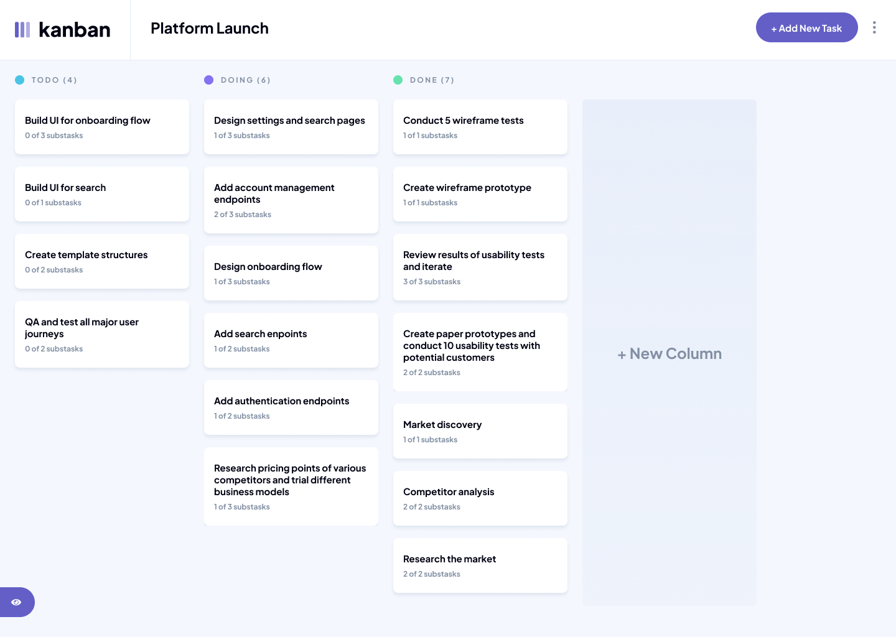
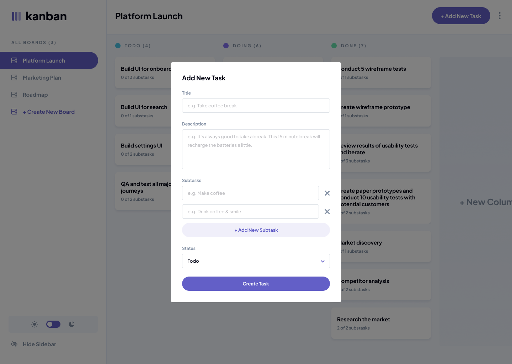
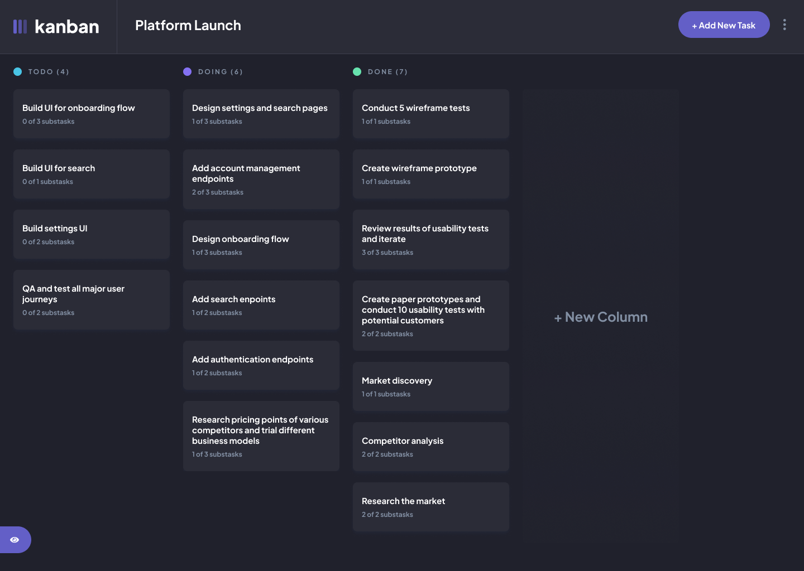

# Kanban Task Management 



## Overview

A Kanban-based task management application built with React, Zustand, and Firestore, designed to provide a smooth and intuitive workflow for organising tasks across boards and columns. The focus of the project was on state-driven UI architecture, real-time data handling, and building a responsive, production-style interface.

## Live Demo

🔗 [Live Site](https://kanbantaskmangement.netlify.app/) · [GitHub Repo](https://github.com/MoSu1248/Kanban-task-management)

## Built With

- React
- JavaScript
- SCSS
- Zustand
- Firebase / Firestore
- Framer Motion
- Vite

## Features

-Kanban-style task management across multiple boards and columns
-Centralized state management using Zustand for predictable UI updates
-Real-time data persistence and synchronization with Firestore
-Fully responsive layout optimized for desktop, tablet, and mobile
-Dynamic UI updates for seamless task creation, editing, and movement

## Getting Started

```bash
# Clone the repo
git clone https://github.com/MoSu1248/your-repo.git

# Install dependencies
npm install

# Run locally
npm run dev
```

## Screenshots




## Author

Mohammed Suhail Rahman · [Portfolio](https://mscreatdev.netlify.app/) · [GitHub](https://github.com/MoSu1248)
